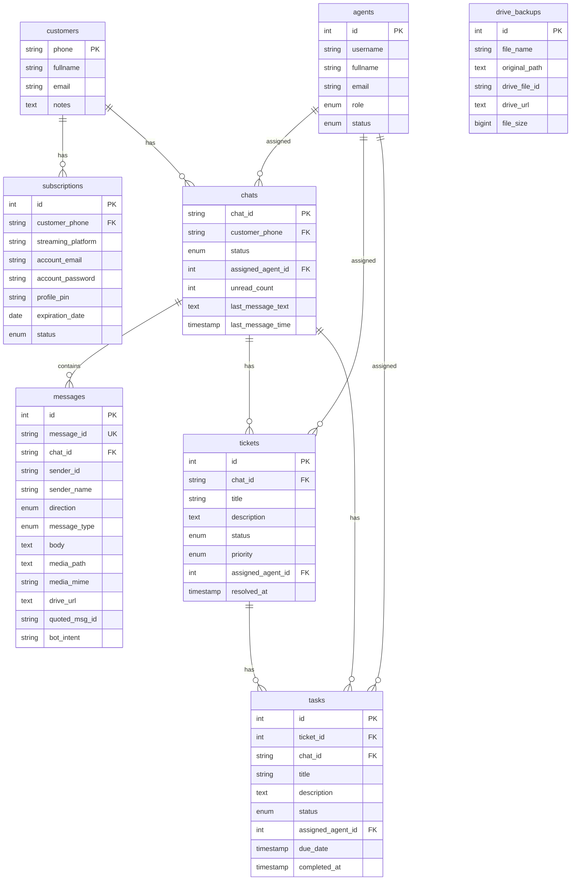

# 🤖 Sheerit WhatBot Documentation

Este repositorio contiene el código fuente del bot de WhatsApp para **Sheerit**, encargado de automatizar ventas, gestión de credenciales y cobranza de servicios de streaming.

## 🌟 Características Principales

### 1. 🧠 Inteligencia Artificial (Gemini Powered)
El bot utiliza modelos de Google Gemini (`gemini-2.0-flash`, `gemini-3-flash`, etc.) para entender el lenguaje natural del usuario en puntos clave:
- **Intención de Compra**: Detecta qué plataformas, planes y periodos (mensual, anual) desea el usuario, incluso si lo escribe de forma coloquial (ej: _"Quiero netfi y disni por un año"_).
- **Métodos de Pago**: Identifica dinámicamente el banco o billetera que el usuario quiere usar (Nequi, Daviplata, Bancolombia, etc.).
- **Fallback Automático**: Si un modelo de IA falla o excede la cuota de uso, el sistema rota automáticamente a otro modelo disponible.

### 2. 🛒 Flujo de Compra Automatizado
- **Activación**: Opción 1 del menú o frase "Hola, estoy interesado en...".
- **Selección Inteligente**:
    1. El usuario dice qué quiere.
    2. La IA extrae los items (Plataformas/Planes).
    3. El bot valida contra `data/platforms.json`.
    4. Se calculan precios, descuentos por combo y ajustes por periodo (anual/semestral).
- **Proceso de Pago**: El bot entrega los datos de la cuenta bancaria correcta según la elección del usuario.

### 3. 🔐 Consulta de Credenciales
- **Activación**: Opción 2 del menú.
- **Funcionamiento**: Consulta la base de datos MySQL (`datos_de_cliente`, `perfil`, `datosCuenta`) usando el número de teléfono del usuario.
- **Resultado**: Entrega correo, contraseña, perfil, PIN y fecha de vencimiento de las cuentas activas.

### 4. 💰 Sistema de Cobranza (Modo Operador)
Comandos especiales para el administrador (definido en `OPERATOR_NUMBER`):
- **Calculadora de Cobros**: Enviando `@bot porfa haz los cobros para hoy de: <lista>`, el bot parsea la lista, contacta a los usuarios individualmente y gestiona las confirmaciones.
- **Liberar Sesión**: `liberar 3001234567` para desconectar al bot de un usuario y permitir atención humana. Se puede usar `liberar masivo` para reactivar a todos los que estaban en espera.
- **Atención de Pendientes (NUEVO)**: `@bot contesta los que estan sin contestar` o `@bot atiende pendientes`. El bot escanea a los usuarios en espera de un humano y les responde automáticamente con ayuda de la IA para retomar el servicio.
- **Confirmar Cobros**: `confirmar_cobros 3001234567` para registrar pagos manualmente.

### 5. 🤖 Inteligencia Colaborativa Avanzada (Actualizado - Mayo 2026)
- **Interceptor Global de Pagos & Vision**: Uso de **Gemini Vision** para detectar comprobantes bancarios, notificando al admin y confirmando al cliente automáticamente.
- **Validación Automática Gmail (Bre-B/QR)**: El bot monitorea en tiempo real la cuenta `jordimemes...` buscando correos de "Venta exitosa por Bre-B". Si el monto coincide con el comprobante enviado por el cliente en un margen de 60 min, el bot **valida y entrega el servicio automáticamente** sin intervención humana.
- **Auditoría de Pagos**: Las notificaciones administrativas incluyen el **Asunto** del correo y el ID de Gmail para una verificación rápida.
- **Deduplicación de Mensajes**: Sistema de caché global para evitar el procesamiento doble de mensajes en ráfagas (Race Conditions).

### 6. 📊 Dashboard Administrativo & Masivos (NUEVO)
- **Difusión Contextual Inteligente**: El bot recuerda de qué cuenta se está hablando. Puedes decir: *"Pasa esta cuenta a todos"* y luego refinar con *"Descarta los extra"* o *"Solo a los activos"*.
- **Reglas de Envío Inteligente**:
    - **Netflix Extra**: Se excluyen de recibir la clave principal por defecto (seguridad).
    - **Filtro de Vencimiento**: No se envían credenciales a clientes con más de 3 días de vencimiento (evita spam a churns).
    - **Enmascaramiento de Credenciales**: Los usuarios vencidos o "Extras" reciben la notificación pero con las claves ocultas (`[Oculto por falta de pago]`), incentivando la renovación.
- **Detector de Fallos Prematuros**: Identifica frases como *"mira lo que sale"* o *"no funciona"* en reportes de fallas técnicas, alertando al grupo de soporte de inmediato si la cuenta aún tiene días vigentes.

### 7. 📅 Programación Inteligente de Mensajes (NUEVO - Mayo 2026)
Permite al administrador programar envíos de mensajes de forma natural a cualquier cliente:
- **Lógica Natural (Español)**: Soporta formatos de tiempo cotidianos como:
    - `"en 10 minutos"`, `"en 2 horas"`, `"en 15 mins"`
    - `"a las 8 am"`, `"a las 15:30"`, `"a las 3:15 pm"`
    - `"mañana"`, `"mañana a las 10 am"`, `"mañana a las 8:30 pm"`
- **Persistencia Anticaídas**: Los mensajes programados se guardan localmente en `scheduled_messages.json`. Si el servidor se apaga o reinicia, las tareas se vuelven a cargar y programar automáticamente en `node-schedule` en el arranque.
- **Flexibilidad de Entrada**:
    - Si se especifica una hora/tiempo, el bot lo agenda y envía una confirmación estructurada al administrador con la hora exacta en zona Bogotá.
    - Si **no** se especifica tiempo, se asume envío inmediato (enviándolo de una vez y confirmando el éxito).

## 📂 Estructura del Proyecto

- `index.js`: **Cerebro Principal**. Maneja la conexión, orquesta estados y el sistema de de-duplicación.
- `aiService.js`: **Módulo de IA**. Lógica de Gemini (Vision, Clasificación de intención, Refinamiento de Masivos).
- `adminQueries.js`: **Motor Analítico**. Procesa las consultas a la base de datos y aplica filtros de masivos.
- `scheduledMessageService.js`: **Gestor de Mensajería Programada**. Maneja la persistencia y la calendarización en tiempo real.
- `gmailService.js`: Integración con la API de Gmail para validación de pagos y códigos.
- `apiService.js`: Integración con Azure Functions para el registro en Excel.

## 🚀 Comandos Administrativos (Desde el Grupo o Directos)

- `@bot confirmar [Número] [Plataforma]`: Valida un pago manualmente (rellena el carrito si estaba vacío).
- `@bot notifica a los de [Cuenta] que [Mensaje]`: Inicia el flujo de envío masivo con pre-visualización.
- `@bot descarta los [Palabra Clave]`: Filtra la lista de envío masivo actual.
- `@bot solo los activos`: Filtra la lista para incluir solo cuentas no vencidas.
- `@bot dile a [Nombre/Número] [Mensaje] [Tiempo]`: Agenda un mensaje para el cliente (ej: `@bot dile a Juan Perez hola cómo estás en 10 minutos`). Si no especificas el tiempo, se envía inmediatamente.
- `@bot dile [Mensaje] [Tiempo]`: En un chat individual de cliente, agenda un mensaje para ese cliente (ej: `@bot dile hola en 15 minutos`).

## 🚀 Cómo Iniciar

1. **Instalar dependencias**: `npm install`
2. **Configurar entorno**: Asegúrate de tener el archivo `.env` y las credenciales en `/tokens`.
3. **Iniciar**: `npm start` o `pm2 start index.js --name whatbot`.

---

## 📊 Base de Datos y Diagrama ER (Entidad-Relación)

Para soportar la bandeja de entrada multi-agente, la gestión de tickets, checklist de tareas y la auditoría de copias de seguridad en Google Drive, el sistema utiliza una base de datos relacional local (MariaDB) estructurada bajo el siguiente modelo:

---

# 🚀 Roadmap de Modernización

## 📌 Estado del Proyecto
- [x] **Fase 1:** Estabilización y Deduplicación (Completado)
- [x] **Fase 2:** Automatización de Pagos Gmail/Bre-B (Completado)
- [x] **Fase 3:** Dashboard Administrativo Contextual (Completado)
- [x] **Fase 4:** Programación Persistente de Mensajes con IA (Completado)
- [ ] **Fase 5:** Autenticación Web & Redis (OTP)
- [x] **Fase 6:** Panel Web de Gestión Directa (Completado - Junio 2026)

---

## 🔒 API de Administración (Servidor Express)

El backend de `whatbot` expone un servidor de Express en el puerto `3000` (por defecto) con los siguientes endpoints para el panel administrativo (`/aiuda/admin` en el frontend):

### Seguridad & Autenticación
Los endpoints que ejecutan acciones de escritura o envío de mensajes de WhatsApp requieren enviar en el body el parámetro `password` configurado como `"admin123"`.

### Endpoints Disponibles

#### 📩 Tickets de Soporte
*   `GET /api/admin/tickets`: Retorna los usuarios en espera de atención humana (`waiting_human`). Resuelve dinámicamente el nombre, fecha del reporte y el último mensaje real del chat en WhatsApp.
*   `POST /api/admin/tickets/claim`: Asigna un asesor (ej. `"Katherine"`) a un ticket para evitar colisiones.
*   `POST /api/admin/tickets/resolve`: Libera la conversación de la memoria del bot para que la IA retome el control automático.

#### 🔑 Cuentas 2FA / TOTP (GPT, Amazon, etc.)
*   `GET /api/admin/gpt-accounts`: Lista las cuentas que usan 2FA y genera sus códigos TOTP activos con los segundos restantes para expirar.
*   `POST /api/admin/gpt-accounts/save`: Agrega o actualiza una clave secreta (semilla/seed TOTP) para un correo.
*   `POST /api/admin/gpt-accounts/delete`: Elimina una cuenta y su semilla del archivo `gpt_secrets.json`.

#### 📧 Correos Gestionados
*   `GET /api/admin/managed-emails`: Retorna la lista de correos autorizados en el archivo `managed_emails.json`.
*   `POST /api/admin/managed-emails/save`: Agrega un nuevo correo al listado.
*   `POST /api/admin/managed-emails/delete`: Remueve un correo del listado.

#### 👥 Clientes & Ventas
*   `GET /api/admin/clients`: Obtiene y mapea los datos de los clientes desde la base de datos o Excel Graph.
*   `POST /api/admin/sales/create`: Registra una nueva venta directamente en el Excel.
*   `GET /api/admin/stats`: Genera estadísticas financieras y de vencimiento (clientes activos, vencidos, alertas y proyecciones a 7, 15 y 30 días, además del cálculo cruzado de clientes Nuevos, Renovaciones y Desistidos/Churn).
*   `POST /api/admin/actions/send-info`: Envía credenciales (`credentials`) o recordatorios de pago (`payment`) de forma manual por WhatsApp.
*   `GET /api/admin/client-history`: Obtiene la línea de tiempo de compras e historial completo de un número celular desde el histórico.

#### 📦 Disponibilidad de Stock
*   `GET /api/admin/availability`: Retorna el estado actual de los bloqueos manuales de entrega inmediata para plataformas y planes.
*   `POST /api/admin/availability/save`: Guarda la configuración de disponibilidad manual (requiere `password`).

---

## 🪵 Formato de Logueo del Servidor (Logs)

El backend de `whatbot` cuenta con un sistema de sobreescritura de consola (`console.log`) integrado al arranque:
1.  **Estampa de Tiempo Local:** Todos los logs generados en el servidor imprimen automáticamente un prefijo con la hora de Colombia (`America/Bogota`), ej: `[02/06/2026 18:40:00] [System] Estado cargado...`.
2.  **Monitoreo del Navegador (Heartbeat):** Cada 5 minutos se ejecuta y registra un reporte de salud del navegador (Puppeteer) para detectar cuelgues (estados zombies), reiniciando el proceso en caso de fallo crítico para que PM2 lo levante de nuevo.

*(Documentación actualizada al 6 de Junio de 2026)*