# 🤖 Sheerit WhatBot Documentation

Este repositorio contiene el código fuente del bot de WhatsApp para **Sheerit**, encargado de automatizar ventas, gestión de credenciales y cobranza de servicios de streaming.

## 🌟 Características Principales

### 1. 🧠 Inteligencia Artificial (Gemini Powered)
El bot utiliza modelos de Google Gemini (`gemini-2.0-flash`, `gemini-3-flash`, etc.) para entender el lenguaje natural del usuario en puntos clave:
- **Intención de Compra**: Detecta qué plataformas, planes y periodos (mensual, anual) desea el usuario, incluso si lo escribe de forma coloquial (ej: _"Quiero netfi y disni por un año"_).
- **Métodos de Pago**: Identifica dinámicamente el banco o billetera que el usuario quiere usar (Nequi, Daviplata, Bancolombia, etc.).
- **Fallback Automático**: Si un modelo de IA falla o excede la cuota de uso, el sistema rota automáticamente a otro modelo disponible.

### 2. 🛒 Flujo de Compra Automatizado
- **Activación**: Opción 1 del menú o frase "Hola, estoy interesado en...".
- **Selección Inteligente**:
    1. El usuario dice qué quiere.
    2. La IA extrae los items (Plataformas/Planes).
    3. El bot valida contra `data/platforms.json`.
    4. Se calculan precios, descuentos por combo y ajustes por periodo (anual/semestral).
- **Proceso de Pago**: El bot entrega los datos de la cuenta bancaria correcta según la elección del usuario.

### 3. 🔐 Consulta de Credenciales
- **Activación**: Opción 2 del menú.
- **Funcionamiento**: Consulta la base de datos MySQL (`datos_de_cliente`, `perfil`, `datosCuenta`) usando el número de teléfono del usuario.
- **Resultado**: Entrega correo, contraseña, perfil, PIN y fecha de vencimiento de las cuentas activas.

### 4. 💰 Sistema de Cobranza (Modo Operador)
Comandos especiales para el administrador (definido en `OPERATOR_NUMBER`):
- **Calculadora de Cobros**: Enviando `@bot porfa haz los cobros para hoy de: <lista>`, el bot parsea la lista, contacta a los usuarios individualmente y gestiona las confirmaciones.
- **Liberar Sesión**: `liberar 3001234567` para desconectar al bot de un usuario y permitir atención humana. Se puede usar `liberar masivo` para reactivar a todos los que estaban en espera.
- **Atención de Pendientes (NUEVO)**: `@bot contesta los que estan sin contestar` o `@bot atiende pendientes`. El bot escanea a los usuarios en espera de un humano y les responde automáticamente con ayuda de la IA para retomar el servicio.
- **Confirmar Cobros**: `confirmar_cobros 3001234567` para registrar pagos manualmente.

### 5. 🤖 Inteligencia Colaborativa Avanzada (Actualizado - Mayo 2026)
- **Interceptor Global de Pagos & Vision**: Uso de **Gemini Vision** para detectar comprobantes bancarios, notificando al admin y confirmando al cliente automáticamente.
- **Validación Automática Gmail (Bre-B/QR)**: El bot monitorea en tiempo real la cuenta `jordimemes...` buscando correos de "Venta exitosa por Bre-B". Si el monto coincide con el comprobante enviado por el cliente en un margen de 60 min, el bot **valida y entrega el servicio automáticamente** sin intervención humana.
- **Auditoría de Pagos**: Las notificaciones administrativas incluyen el **Asunto** del correo y el ID de Gmail para una verificación rápida.
- **Deduplicación de Mensajes**: Sistema de caché global para evitar el procesamiento doble de mensajes en ráfagas (Race Conditions).

### 6. 📊 Dashboard Administrativo & Masivos (NUEVO)
- **Difusión Contextual Inteligente**: El bot recuerda de qué cuenta se está hablando. Puedes decir: *"Pasa esta cuenta a todos"* y luego refinar con *"Descarta los extra"* o *"Solo a los activos"*.
- **Reglas de Envío Inteligente**:
    - **Netflix Extra**: Se excluyen de recibir la clave principal por defecto (seguridad).
    - **Filtro de Vencimiento**: No se envían credenciales a clientes con más de 3 días de vencimiento (evita spam a churns).
    - **Enmascaramiento de Credenciales**: Los usuarios vencidos o "Extras" reciben la notificación pero con las claves ocultas (`[Oculto por falta de pago]`), incentivando la renovación.
- **Detector de Fallos Prematuros**: Identifica frases como *"mira lo que sale"* o *"no funciona"* en reportes de fallas técnicas, alertando al grupo de soporte de inmediato si la cuenta aún tiene días vigentes.

### 7. 📅 Programación Inteligente de Mensajes (NUEVO - Mayo 2026)
Permite al administrador programar envíos de mensajes de forma natural a cualquier cliente:
- **Lógica Natural (Español)**: Soporta formatos de tiempo cotidianos como:
    - `"en 10 minutos"`, `"en 2 horas"`, `"en 15 mins"`
    - `"a las 8 am"`, `"a las 15:30"`, `"a las 3:15 pm"`
    - `"mañana"`, `"mañana a las 10 am"`, `"mañana a las 8:30 pm"`
- **Persistencia Anticaídas**: Los mensajes programados se guardan localmente en `scheduled_messages.json`. Si el servidor se apaga o reinicia, las tareas se vuelven a cargar y programar automáticamente en `node-schedule` en el arranque.
- **Flexibilidad de Entrada**:
    - Si se especifica una hora/tiempo, el bot lo agenda y envía una confirmación estructurada al administrador con la hora exacta en zona Bogotá.
    - Si **no** se especifica tiempo, se asume envío inmediato (enviándolo de una vez y confirmando el éxito).

## 📂 Estructura del Proyecto

- `index.js`: **Cerebro Principal**. Maneja la conexión, orquesta estados y el sistema de de-duplicación.
- `aiService.js`: **Módulo de IA**. Lógica de Gemini (Vision, Clasificación de intención, Refinamiento de Masivos).
- `adminQueries.js`: **Motor Analítico**. Procesa las consultas a la base de datos y aplica filtros de masivos.
- `scheduledMessageService.js`: **Gestor de Mensajería Programada**. Maneja la persistencia y la calendarización en tiempo real.
- `gmailService.js`: Integración con la API de Gmail para validación de pagos y códigos.
- `apiService.js`: Integración con Azure Functions para el registro en Excel.

## 🚀 Comandos Administrativos (Desde el Grupo o Directos)

- `@bot confirmar [Número] [Plataforma]`: Valida un pago manualmente (rellena el carrito si estaba vacío).
- `@bot notifica a los de [Cuenta] que [Mensaje]`: Inicia el flujo de envío masivo con pre-visualización.
- `@bot descarta los [Palabra Clave]`: Filtra la lista de envío masivo actual.
- `@bot solo los activos`: Filtra la lista para incluir solo cuentas no vencidas.
- `@bot dile a [Nombre/Número] [Mensaje] [Tiempo]`: Agenda un mensaje para el cliente (ej: `@bot dile a Juan Perez hola cómo estás en 10 minutos`). Si no especificas el tiempo, se envía inmediatamente.
- `@bot dile [Mensaje] [Tiempo]`: En un chat individual de cliente, agenda un mensaje para ese cliente (ej: `@bot dile hola en 15 minutos`).

## 🚀 Cómo Iniciar

1. **Instalar dependencias**: `npm install`
2. **Configurar entorno**: Asegúrate de tener el archivo `.env` y las credenciales en `/tokens`.
3. **Iniciar**: `npm start` o `pm2 start index.js --name whatbot`.

---

## 📊 Base de Datos y Diagrama ER (Entidad-Relación)

Para soportar la bandeja de entrada multi-agente, la gestión de tickets, checklist de tareas y la auditoría de copias de seguridad en Google Drive, el sistema utiliza una base de datos relacional local (MariaDB) estructurada bajo el siguiente modelo:

```mermaid
erDiagram
    agents {
        int id PK
        string username
        string fullname
        string email
        enum role "admin, agent, supervisor, trial"
        enum status "active, inactive, busy"
        decimal max_weekly_hours
        boolean exclude_from_payroll
    }
    customers {
        string phone PK
        string fullname
        string email
        text notes
    }
    subscriptions {
        int id PK
        string customer_phone FK
        string streaming_platform
        string account_email
        string account_password
        string profile_pin
        date expiration_date
        enum status "active, expired, cancelled"
        boolean is_provider
        string provider_name
        string payment_method
    }
    chats {
        string chat_id PK
        string customer_phone FK
        enum status "bot, waiting_human, advisor, closed"
        int assigned_agent_id FK
        int unread_count
        text last_message_text
        timestamp last_message_time
    }
    messages {
        int id PK
        string message_id UK
        string chat_id FK
        string sender_id
        string sender_name
        text body
        text media_path
        string media_mime
        boolean is_from_me
        string bot_intent
    }
    tickets {
        int id PK
        string chat_id FK
        string title
        text description
        enum status "open, assigned, resolved, pending_customer"
        enum priority "low, medium, high, critical"
        int assigned_agent_id FK
        timestamp resolved_at
    }
    tasks {
        int id PK
        int ticket_id FK
        string chat_id FK
        string title
        text description
        enum status "pending, in_progress, completed, cancelled"
        int assigned_agent_id FK
        timestamp due_date
        timestamp completed_at
    }
    heavy_tickets {
        int id PK
        string title
        text description
        enum status "pending, in_progress, completed, cancelled"
        enum priority "low, medium, high, critical"
        string assigned_agent
    }
    heavy_ticket_comments {
        int id PK
        int ticket_id FK
        string agent_name
        text comment
    }
    monthly_payroll {
        int id PK
        int agent_id FK
        string payroll_month
        date start_date
        date end_date
        decimal total_hours
        decimal trial_hours
        decimal normal_hours
        decimal hourly_rate
        decimal total_bonuses
        decimal total_payment
        string status "draft, paid"
    }
    agent_bonuses {
        int id PK
        int agent_id FK
        string payroll_month
        decimal amount
        string reason
        string created_by
    }
    agent_schedules {
        int id PK
        int agent_id FK
        string week_start
        int day_of_week
        time start_time
        time end_time
        enum break_type
        time break_start
    }
    system_configs {
        string cfg_key PK
        text cfg_value
    }
    rpa_recipes {
        int id PK
        string name
        string platform
        longtext recipe_json
    }
    drive_backups {
        int id PK
        string file_name
        text file_path
        string drive_file_id
        text drive_url
        int file_size
    }
    web_sales_pending {
        string order_id PK
        string firstName
        string lastName
        string email
        string whatsapp
        string platformName
        int amount
    }
    web_sales_approved {
        string order_id PK
        string firstName
        string lastName
        string email
        string whatsapp
        string platformName
        int amount
        timestamp approvedAt
    }

    agents ||--o{ chats : "assigned"
    agents ||--o{ tickets : "assigned"
    agents ||--o{ tasks : "assigned"
    agents ||--o{ monthly_payroll : "has"
    agents ||--o{ agent_bonuses : "has"
    agents ||--o{ agent_schedules : "has"
    customers ||--o{ subscriptions : "has"
    customers ||--o{ chats : "has"
    chats ||--o{ messages : "contains"
    chats ||--o{ tickets : "has"
    chats ||--o{ tasks : "has"
    heavy_tickets ||--o{ heavy_ticket_comments : "has_comments"
```



---

# 🚀 Roadmap de Modernización


## 📌 Estado del Proyecto
- [x] **Fase 1:** Estabilización y Deduplicación (Completado)
- [x] **Fase 2:** Automatización de Pagos Gmail/Bre-B (Completado)
- [x] **Fase 3:** Dashboard Administrativo Contextual (Completado)
- [x] **Fase 4:** Programación Persistente de Mensajes con IA (Completado)
- [ ] **Fase 5:** Autenticación Web & Redis (OTP)
- [x] **Fase 6:** Panel Web de Gestión Directa (Completado - Junio 2026)

---

## 🔒 API de Administración (Servidor Express)

El backend de `whatbot` expone un servidor de Express en el puerto `3000` (por defecto) con los siguientes endpoints para el panel administrativo (`/aiuda/admin` en el frontend):

### Seguridad & Autenticación
Los endpoints que ejecutan acciones de escritura o envío de mensajes de WhatsApp requieren enviar en el body el parámetro `password` configurado como `"admin123"`.

### Endpoints Disponibles

#### 📩 Tickets de Soporte
*   `GET /api/admin/tickets`: Retorna los usuarios en espera de atención humana (`waiting_human`). Resuelve dinámicamente el nombre, fecha del reporte y el último mensaje real del chat en WhatsApp.
*   `POST /api/admin/tickets/claim`: Asigna un asesor (ej. `"Katherine"`) a un ticket para evitar colisiones.
*   `POST /api/admin/tickets/resolve`: Libera la conversación de la memoria del bot para que la IA retome el control automático.

#### 🔑 Cuentas 2FA / TOTP (GPT, Amazon, etc.)
*   `GET /api/admin/gpt-accounts`: Lista las cuentas que usan 2FA y genera sus códigos TOTP activos con los segundos restantes para expirar.
*   `POST /api/admin/gpt-accounts/save`: Agrega o actualiza una clave secreta (semilla/seed TOTP) para un correo.
*   `POST /api/admin/gpt-accounts/delete`: Elimina una cuenta y su semilla del archivo `gpt_secrets.json`.

#### 📧 Correos Gestionados
*   `GET /api/admin/managed-emails`: Retorna la lista de correos autorizados en el archivo `managed_emails.json`.
*   `POST /api/admin/managed-emails/save`: Agrega un nuevo correo al listado.
*   `POST /api/admin/managed-emails/delete`: Remueve un correo del listado.

#### 👥 Clientes & Ventas
*   `GET /api/admin/clients`: Obtiene y mapea los datos de los clientes desde la base de datos o Excel Graph.
*   `POST /api/admin/sales/create`: Registra una nueva venta directamente en el Excel.
*   `GET /api/admin/stats`: Genera estadísticas financieras y de vencimiento (clientes activos, vencidos, alertas y proyecciones a 7, 15 y 30 días, además del cálculo cruzado de clientes Nuevos, Renovaciones y Desistidos/Churn).
*   `POST /api/admin/actions/send-info`: Envía credenciales (`credentials`) o recordatorios de pago (`payment`) de forma manual por WhatsApp.
*   `GET /api/admin/client-history`: Obtiene la línea de tiempo de compras e historial completo de un número celular desde el histórico.

#### 📦 Disponibilidad de Stock
*   `GET /api/admin/availability`: Retorna el estado actual de los bloqueos manuales de entrega inmediata para plataformas y planes.
*   `POST /api/admin/availability/save`: Guarda la configuración de disponibilidad manual (requiere `password`).

---

## 🛠️ Actualizaciones Recientes (21 de Junio de 2026)

### 1. 🛡️ Robustez en Gestión de Llamadas (whatsapp-web.js)
- **Aislamiento de Errores de Colgado**: Se reestructuraron los manejadores de eventos `call` e `incoming_call` envolviendo el método inestable `call.reject()` en un bloque try-catch independiente.
- **Garantía de Envío de Aviso**: Si el colgado de llamada activa falla debido a limitaciones de la librería en WhatsApp Web, el bot ya no aborta la ejecución y continúa enviando exitosamente el aviso de chat al usuario:
  > *"🤖 AVISO DE SOPORTE: Hola... Te informamos que nuestro soporte y atención es exclusivamente por CHAT..."*

### 2. ❓ Interceptor de Mensajes de Símbolos/Interrogación (`?????`)
- **Filtro de Signos**: Se implementó una detección directa en `generateEmpatheticFallback` para interceptar mensajes compuestos únicamente de signos de interrogación o caracteres especiales (`?`, `?????`, `¿?`).
- **Clarificación de Dudas**: El bot responde con un mensaje amigable guiando al usuario a detallar su consulta en lugar de llamar a la IA, la cual solía confundirse o alucinar basándose en el historial de cobros de forma ciega.

### 3. 📸 Detección Automática de Capturas de Pantalla 2FA (Disney+, Netflix, etc.)
- **OCR General Mejorado**: El lector de imágenes de Gemini se actualizó para no solo analizar comprobantes de pago, sino también detectar capturas de inicio de sesión/2FA y extraer el correo mostrado y el tipo de código requerido.
- **Flujo de Soporte Inteligente**: Al recibir una captura de 2FA, el bot detecta automáticamente que es una solicitud de código, busca el servicio en las cuentas del cliente e inicia el flujo de extracción automática (TOTP o Gmail), en lugar de transferir inmediatamente al cliente a la cola de espera de asesores humanos.

### 4. 🌐 Portal SaaS y RPA con Scribe
- **Vinculación de WhatsApp sin Terminal (QR/OTP)**: Se crearon endpoints de Server-Sent Events (SSE) `/api/whatsapp/status-stream` y de solicitud de código de emparejamiento `/api/whatsapp/request-pairing-code` (OTP de 8 caracteres). Esto permite a los clientes de la plataforma SaaS vincular sus números oficiales y visualizar el estado del bot en tiempo real desde la web.
- **Configurador de Prompts**: Se crearon endpoints `/api/config/prompts` y `/api/config/prompts/save` integrados con una nueva tabla `system_configs` en la base de datos MySQL, permitiendo ajustar los prompts de la IA de forma persistente y dinámica.
- **RPA Builder de Scribe a Puppeteer**: Nueva lógica que permite subir el PDF exportado de Scribe al endpoint `/api/admin/rpa/import-scribe`, interpretarlo por medio del modelo multimodal de Gemini y convertirlo automáticamente en una receta JSON ejecutable paso a paso en Puppeteer (hacer clics, rellenar campos, esperar selectores y extraer códigos OTP de paneles de proveedores de terceros).

---

## 🪵 Formato de Logueo del Servidor (Logs)

El backend de `whatbot` cuenta con un sistema de sobreescritura de consola (`console.log`) integrado al arranque:
1.  **Estampa de Tiempo Local:** Todos los logs generados en el servidor imprimen automáticamente un prefijo con la hora de Colombia (`America/Bogota`), ej: `[02/06/2026 18:40:00] [System] Estado cargado...`.
2.  **Monitoreo del Navegador (Heartbeat):** Cada 5 minutos se ejecuta y registra un reporte de salud del navegador (Puppeteer) para detectar cuelgues (estados zombies), reiniciando el proceso en caso de fallo crítico para que PM2 lo levante de nuevo.

*(Documentación actualizada al 21 de Junio de 2026)*

---

## 🛠️ Actualizaciones Recientes (24 de Junio de 2026)

### 1. 🧠 Sub-intenciones y Flujo de Paréntesis (`duda_contexto`)
- **Flujos de Interrupción**: Se implementó una lógica de paréntesis conversacional para preguntas que rompen el flujo principal (ej: *"¿de quién es la cuenta de Nequi?"*, *"¿manual cómo así?"*, *"¿qué características tiene el plan?"*).
- **Mantener Estado del Funnel**: La IA intercepta estas dudas contextuales, las responde con precisión revisando el historial ampliado y la base de conocimiento, pero **mantiene intacto el estado actual del usuario** en el embudo (como `awaiting_payment_method` o `selecting_plans`), evitando reiniciar o romper su flujo de compra.
- **Historial Ampliado**: El historial reciente pasado a la IA se amplió de 6 a **15 mensajes** por defecto, evitando la pérdida de contexto en conversaciones rápidas.

### 2. 📅 Panel de Pagos y Horarios de Colaboradores
- **Reorganización de Vista**: En el panel administrativo se colocó la gestión de horarios y franjas de disponibilidad al inicio y la configuración de métodos de pago al final.
- **Visualización Unificada ("Vista General")**: Se integró una cuadrícula en el panel que muestra los turnos de todos los colaboradores asignados (Camilo, Katherine, Esclépides) en un solo lugar.
- **Gestión de Descansos (Lunch/Break)**: Cada franja permite configurar almuerzos (1 hora 🍱) o descansos (30 minutos ☕). Estas franjas se restan del cálculo de horas laborales netas.

### 3. 🟢 Estado Dinámico del Soporte Técnico de Sheerit
- **Detección Activa de Asesores**: El bot determina en tiempo real si el canal de soporte humano está **ONLINE** u **OFFLINE** analizando las franjas horarias y descansos de los colaboradores.
- **Desactivación del Bot**: Si hay al menos un colaborador activo y fuera de su break, el soporte se considera online. Si todos están offline o en hora de almuerzo, el canal se marca automáticamente como cerrado y el bot responde amablemente informando los horarios.

---

## 🛠️ Actualizaciones Recientes (30 de Junio de 2026)

### 1. 📅 Calendario de Horarios Persistente y Paginable
- **Persistencia de Fechas**: Los horarios ahora se registran con base en fechas de calendario reales mediante la combinación de `week_start` (Lunes de la semana en curso) y `day_of_week`. Esto asegura que los datos no se sobreescriban semana a semana, habilitando el análisis histórico y cálculo de nómina.
- **Paginador de Semanas**: Se implementó una barra de navegación que permite revisar y planificar turnos o asegurar descansos en semanas futuras. Si una semana no tiene turnos específicos, el sistema hereda automáticamente la **Plantilla Base (Default)** del colaborador.
- **Unificación de Vistas**: Admins y asesores utilizan la misma cuadrícula de turnos de todo el equipo. Los asesores comunes solo pueden editar su propio horario, mientras que el administrador puede editar el de todos.

### 2. 💸 Gestión de Nómina Mensual y Bonos (Panel de Esteban)
- **Acceso Restringido**: Nueva pestaña **"Nómina y Pagos"** visible únicamente para el usuario `estebanavila182@outlook.com`.
- **Cálculo Automático**: Muestra el total de horas netas acumuladas por asesor en el mes y estima el total a pagar en tiempo real.
- **Módulo de Bonificaciones**: Permite registrar y eliminar bonos o incentivos detallados con motivo para cada colaborador.
- **Cierre de Nómina**: Permite archivar/cerrar los registros mensuales de nómina persistiendo los totales en la tabla `monthly_payroll` para contabilidad.
- **Valor Hora Configurable**: Ajuste del valor de la hora de soporte (por defecto `$8,333` COP) editable por el administrador.

### 3. 🛡️ Control de Horas Extras, Relojito y Cuidado de Salud Mental
- **Bloqueo de Horas Extras**: Interruptor administrativo `allow_overtime`. Si se desactiva, restringe a un máximo de 8.0 horas netas de trabajo diario por colaborador (se valida en frontend y backend).
- **Dropdowns del Minutero Exacto**: Los selectores de hora de inicio, fin y break ahora son dropdowns en pasos de 30 minutos (ej. `09:30`), impidiendo el ingreso de minutos arbitrarios.
- **Regla de Salud Mental (Separación de Break)**: La hora del almuerzo/break no puede ubicarse al extremo de la franja. El sistema calcula y exige una separación mínima de **1.5 horas (90 minutos)** respecto a la hora de entrada y la hora de salida de la franja.

### 4. 🚨 Alerta de Huecos de Cobertura en WhatsApp
- **Cron de Cobertura (6:00 PM)**: Un trabajo programado analiza diariamente a las 18:00 si el día de mañana tiene huecos (tiempos desatendidos dentro de la jornada de atención). Si se detectan brechas libres sin asesores asignados, envía de forma automática un mensaje detallado de alerta al grupo de WhatsApp de administración.

---

## 🛠️ Actualizaciones Recientes (3 de Julio de 2026)

### 1. 🧠 Clasificación de Tickets Optimizada (DeepSeek + Caché Delta)
- **Migración a DeepSeek**: Se cambió el motor de clasificación masiva de tickets de Gemini Lite a DeepSeek Chat (`callDeepSeek`), logrando una estructuración JSON y análisis de intenciones conversacionales infinitamente superior y sin alucinaciones.
- **Sistema de Caché Delta**: Se implementó `classifiedTicketsCache` en memoria. El bot ahora realiza la validación contra el último mensaje y estado de cada chat. Si no hay novedades en los chats, **cancela la llamada a la IA de inmediato** (0 consumo de API). Si hay cambios, **envía únicamente el ticket modificado a clasificar**, reduciendo el uso de tokens en un 95% y eliminando la latencia en las consultas del panel de soporte técnico.
- **Contexto de Estado de Tickets**: Se le pasa a DeepSeek el estado en vivo del chat (`waiting_human`, `awaiting_payment_confirmation`, etc.) junto con reglas estrictas de flujo para impedir que clasifique erróneamente en "Probablemente Terminados" a usuarios que están esperando activamente en cola.

### 2. 📸 Auto-Entrega de Códigos 2FA / ChatGPT por Imagen
- **OCR Multi-Intenciones**: Se expandió el detector visual de imágenes de Gemini (`wantsImgCode`) agregando palabras clave amplias de errores técnicos (`'error', 'fallo', 'falla', 'bloqueo', 'limite'`, etc.) e inicios de sesión 2FA (`'gpt', 'chatgpt', '2fa', 'authenticator', 'openai'`).
- **Entrega Inmediata**: Si un cliente envía una captura de pantalla solicitando el código de su cuenta de ChatGPT o alguna plataforma de streaming con doble factor, el bot la detecta mediante OCR, se reactiva automáticamente, calcula el código TOTP offline desde `gpt_secrets.json` y se lo responde en segundos sin intervención del asesor.

### 3. 👤 Resolución Directa de Nombres de Clientes
- **Búsqueda por BD local**: Si el cliente no tiene suscripciones de streaming activas vinculadas (lo que impedía traer su nombre desde el Excel), ahora el endpoint `/api/admin/tickets` consulta directamente la tabla local de MariaDB `customers` usando el número de teléfono del chat.
- **Visualización Limpia**: Esto garantiza que nombres registrados (como en el caso de *Aldren Nobles*) se muestren correctamente en el Dashboard administrativo en lugar de mostrar su número telefónico genérico.

### 4. 🛡️ Estabilidad Conversacional y Anticaídas (Anti-Spam)
- **Evitar Spam de Bienvenida**: En el escaneo de mensajes pendientes al iniciar el bot, se implementó un filtro de tiempo de máximo 2 horas. Si el mensaje sin leer tiene más antigüedad, el bot lo ignora, previniendo que se disparen saludos automáticos de forma masiva a clientes con chats viejos tras una desconexión.
- **Cierre Limpio de Clientes Zombies**: Si la conexión de Puppeteer falla críticamente al inicializar (ej. `Execution context was destroyed`), el bot realiza un cierre limpio forzado (`process.exit(1)`). Esto activa el ciclo de auto-recuperación de PM2 para reintentar la conexión de WhatsApp Web de forma transparente en segundos.
- **Optimización Gmail en Tiempo Real**: Se eliminó el parámetro de búsqueda indexada `q` de la API de Gmail (el cual sufría retrasos de indexación de hasta 3 minutos). Ahora el bot recupera los últimos correos del Inbox directamente y los filtra en memoria, permitiendo que los códigos OTP de Amazon/Prime Video, Netflix y demás plataformas se extraigan e informen al instante.

---

## 🛠️ Actualizaciones Recientes (13 de Julio de 2026)

### 1. 📂 Bandeja de Entrada Unificada con Filtros de Pestañas
- **Pestañas de Navegación**: Se rediseñó la barra lateral izquierda del panel administrativo agregando pestañas de acceso rápido:
  *   **Mis Tickets**: Muestra una lista limpia con los chats asignados al asesor en sesión.
  *   **Tickets Activos**: Muestra la vista categorizada clásica de acordeones (Mis Tickets, Libres, Otros, Probablemente Terminados, Archivados y agrupados).
  *   **Todos los Chats**: Permite acceder al histórico de las últimas 150 conversaciones en la base de datos de manera cronológica plana, permitiendo a los asesores monitorear qué responde el bot o reclamar cualquier chat en cualquier momento.

### 2. 🛡️ Filtro Estricto de Credenciales por Plataforma (Prevención de Alucinaciones)
- **Extracción de Plataforma**: Se implementó una lógica de parseo en `billingService.js` (`processCheckCredentials`) para identificar la plataforma exacta solicitada por el usuario en lenguaje natural.
- **Aislamiento de Cuentas**: Si el usuario tiene la plataforma activa, el bot le expone a Gemini únicamente los datos de ese servicio, evitando alucinaciones de claves cruzadas (ej: entregar datos de Prime Video haciéndolos pasar por Netflix). Si el usuario no la tiene activa, el bot le ofrece comprarla, pasa el chat a `waiting_human` y lo etiqueta para revisión humana.

### 3. 👥 Auto-Asociación y Confirmación Interactiva Multi-Cuenta (Laura Mejía Fallback)
- **Fallback Multi-Cuenta**: Al interceptar un pago genérico (`"Sheerit"`) de un usuario que posee múltiples servicios activos, el bot ahora autollena de manera implícita su carrito de transacciones con **todas sus cuentas activas** en lugar de crear un servicio genérico `"Sheerit"`.
- **Confirmación Interactiva**: El bot preguntará de forma interactiva al usuario si desea renovar todos sus servicios activos. Si el usuario responde "1" (Sí), renovará todos sus servicios en el Excel simultáneamente al procesar la validación. Si responde "2" (No), se pausará el proceso automático y se notificará al grupo de soporte.

### 4. 📊 Agrupación del Historial de Cortes de Excel
- **Corte por Mes Legible**: Se optimizó la función `procesarHistoricoArray` para agrupar los bloques del Excel Histórico por su nombre de mes general (ej: `"Julio de 2026"`, `"Junio de 2026"`), evitando que se muestren fechas arbitrarias o de celdas vacías (`"hoy"`) como títulos de corte.
- **Mapeo Seguro**: Mantiene el mapeo de la fecha de renovación del servicio desde la columna `"deben"` y su vencimiento real.

---

## 🛡️ Medidas de Estabilidad y Anti-Detección (WhatsApp Web / Puppeteer)

Para evitar bloqueos por parte de los sistemas automatizados de WhatsApp y asegurar que el bot no entre en bucle infinito de reinicios, el constructor de `Client` en [index.js](file:///Users/estebanavila/desarrollo/whatbot/index.js) debe configurarse estrictamente bajo las siguientes pautas de seguridad:

### 1. Camuflaje Anti-Detección (Anti-Bot)
* **User-Agent de Escritorio Real:** Siempre se debe pasar una cabecera de navegador real en el constructor para evitar el User-Agent headless por defecto de Chromium:
  `userAgent: 'Mozilla/5.0 (Windows NT 10.0; Win64; x64) AppleWebKit/537.36 (KHTML, like Gecko) Chrome/126.0.0.0 Safari/537.36'`
* **Bandera de Evasión de webdriver:** Se debe inyectar la bandera `--disable-blink-features=AutomationControlled` dentro de la sección `args` de `puppeteer`. Esto deshabilita la propiedad `navigator.webdriver` en la página, haciendo que el navegador de Puppeteer sea indistinguible de un Chrome humano ante los scripts de telemetría de WhatsApp Web.

### 2. Control de Versiones Web de WhatsApp (webVersionCache)
* **Uso de Versión Remota Validada:** No utilizar versiones locales o Alfa no probadas que puedan causar el rechazo de WebSocket de WhatsApp Web. Utilizar una versión compatible y pre-validada desde la caché remota:
  ```javascript
  webVersionCache: {
      type: 'remote',
      remotePath: 'https://raw.githubusercontent.com/wppconnect-team/wa-version/main/html/2.2413.51-pre.html',
      strict: false
  }
  ```

### 3. Protección contra Bucles de Reinicio Rápido
* **Desconexiones en Frío:** En el handler `disconnected`, el bot detecta el estado actual a través de `currentWhatsappStatus`. Si el bot se desconecta antes de estar logueado (`CONNECTED`), el bot esperará **15 segundos** antes de ejecutar `process.exit(1)`. Esto previene bucles de reinicio rápidos y protege la dirección IP del servidor contra el rate-limiting de WhatsApp.