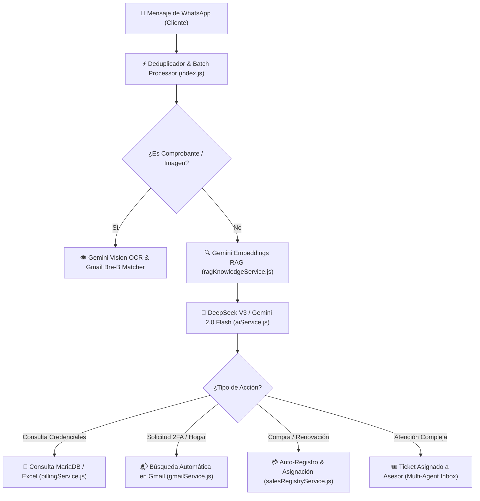

# 🤖 Sheerit WhatBot - Documentación Integral del Sistema (2026)

Este repositorio contiene el código fuente del ecosistema de automatización de WhatsApp para **Sheerit Store / PueblApp**, encargado de orquestar ventas en línea, atención al cliente con IA generativa, búsqueda semántica vectorial (RAG), validación automática de pagos bancarios (Bre-V / Nequi / Bancolombia / Bold), asignación y renovación de suscripciones de streaming, contabilidad en tiempo real y bandeja de entrada multi-agente para asesores humanos.

---

## 🌟 Características Principales del Sistema


```mermaid
flowchart TD
    A["📱 Mensaje de WhatsApp (Cliente)"] --> B["⚡ Deduplicador & Batch Processor (index.js)"]
    B --> C{"¿Es Comprobante / Imagen?"}
    C -->|Sí| D["👁️ Gemini Vision OCR & Gmail Bre-B Matcher"]
    C -->|No| E["🔍 Gemini Embeddings RAG (ragKnowledgeService.js)"]
    E --> F["🧠 DeepSeek V3 / Gemini 2.0 Flash (aiService.js)"]
    F --> G{"¿Tipo de Acción?"}
    G -->|Consulta Credenciales| H["🔐 Consulta MariaDB / Excel (billingService.js)"]
    G -->|Solicitud 2FA / Hogar| I["📬 Búsqueda Automática en Gmail (gmailService.js)"]
    G -->|Compra / Renovación| J["💳 Auto-Registro & Asignación (salesRegistryService.js)"]
    G -->|Atención Compleja| K["🎟️ Ticket Asignado a Asesor (Multi-Agent Inbox)"]
```

---

### 1. 🧠 Motor RAG Semántico y Búsqueda Vectorial (`ragKnowledgeService.js`)
* **Modelo Vectorial:** Google Gemini `gemini-embedding-001` (vectores densos de 3072 dimensiones).
* **Indexación Exhaustiva:** Al arrancar el bot, se fragmenta y vectoriza el contenido de `support.json`, `knowledge_base.json`, `policies.json` y `platforms.json`.
* **Caché Vectorial Local:** Los vectores se guardan en `knowledge_embeddings_cache.json` con hash criptográfico MD5 para arrancar en **<5 ms** sin llamadas redundantes a la API.
* **Similitud de Coseno en Memoria:** Ante cada mensaje del cliente (*"no me agarra el pin"*, *"me salió lo de viaje en el tele"*, *"no veo mi nombre en los perfiles"*), el bot recupera en <2 ms los artículos exactos de soporte e inyecta únicamente ese contexto en el prompt.
* **Ahorro de Costos:** Reduce el consumo de tokens de entrada en DeepSeek en un **70%**, haciendo que el saldo rinda meses completos.

---

### 2. 🔄 Sistema Inteligente de Renovaciones y Asignación de Cupos (`salesRegistryService.js`)
* **Detección Automática de Renovación:** Cuando un cliente paga (por Bre-V, QR o web), el sistema busca si el cliente ya tiene una fila activa o vencida para esa plataforma por su número de teléfono o nombre.
* **Preservación de Invitaciones Familiares:** En plataformas como **Apple One, Spotify Familiar, YouTube Premium o Crunchyroll**, si es una renovación, el bot extiende la fecha de vencimiento (`deben`) y confirma el acceso inmediatamente **sin volver a pedirle el correo de Apple ID ni invitaciones innecesarias**.
* **Prioridad de Precios Oficiales:** Los precios de renovación se calculan consultando siempre el catálogo oficial vigente en `platforms.json` / `streaming_prices`, evitando desactualizaciones por valores históricos en hojas de cálculo.

---

### 3. 👁️ Visión por Computadora (OCR) e Interceptor de Fallas
* **Detección de Pantallas de Televisor:** Reconoce fotos de errores comunes:
  * **Netflix Hogar / Viaje:** Identifica pantallas de *"¿Entendimos mal? Si estás de viaje o fuera de casa..."* y guía al cliente paso a paso a presionar *"Ver temporalmente"* y solicitar el código de 4 dígitos o ingresar a [https://sheerit.co/actualizar](https://sheerit.co/actualizar).
  * **Disney 2FA / Códigos de Acceso:** Extrae los correos y solicita el código de 6 dígitos automáticamente.
  * **Asignación de Perfiles:** Guía al usuario a presionar el botón `+` o *"Añadir perfil"* con su nombre registrado.
* **Validación de Comprobantes:** Extrae fecha, hora, monto y código de transacción de comprobantes de Nequi, Daviplata, Bancolombia, dale!, Lulo y Bre-V.

---

### 4. ⚡ Validación Automática de Pagos en Tiempo Real (Gmail Bre-V / Bold)
* **Monitoreo Continuo:** Monitorea la bandeja de entrada de Gmail buscando notificaciones de *"Venta exitosa por Bre-B"*.
* **Match Inmediato:** Si el monto y la hora coinciden con la solicitud del cliente en un margen de 60 minutos:
  1. Marca el pago como aprobado.
  2. Registra la venta en la hoja de control en Azure / MariaDB.
  3. Entrega las credenciales o renueva la suscripción en el chat de WhatsApp en menos de 5 segundos.
* **Pasarela Bold Web:** Integración con `/api/bold/check-status/:orderId` para redireccionar al portal de autoservicio `/verificar?tel=57300...` tras el pago exitoso.

---

### 5. 🎟️ Bandeja de Entrada Multi-Agente y Gestión de Tickets
* **Filtrado Inteligente de Tickets Libres:** Los mensajes salientes enviados por los propios asesores (ej: difusiones masivas o avisos manuales de corte *"Buen día, estamos en proceso de corte..."*) **no ensucian la bandeja de Tickets Libres**. Un chat solo se convierte en ticket pendiente cuando el cliente responde y requiere atención.
* **Bypass de Códigos en Modo Silencio:** Si un asesor intervino manualmente en un chat, el bot se silencia para respetar la conversación humana; sin embargo, si el cliente pide un código OTP o 2FA, el bot responde de inmediato porque los códigos caducan en 15 minutos.
* **Horarios Dinámicos de Asesores:** Mensajes de expectativa ajustados según el turno laboral activo (Lunes a Viernes 10 AM a 10 PM, Fines de semana 4 PM a 10 PM).

---

### 6. 📅 Programación de Mensajes y Difusiones Contextuales
* **Lenguaje Natural en Español:** Permite al administrador agendar envíos:
  * `@bot dile a Juan Perez hola cómo estás en 10 minutos`
  * `@bot dile tu servicio ya está activo mañana a las 8 am`
  * `@bot notifica a los de Netflix que la clave cambió`
* **Persistencia Anticaídas:** Los mensajes agendados se guardan en `scheduled_messages.json` y se re-programan automáticamente en `node-schedule` ante reinicios del servidor.

---

## 📊 Base de Datos y Diagrama ER (MariaDB / MySQL)

La base de datos relacional del sistema (`whatbot`) soporta toda la plataforma multi-agente, la contabilidad, auditoría, analítica web y sincronización:


```mermaid
erDiagram
    agents ||--o{ agent_schedules : "cumple horario"
    agents ||--o{ agent_bonuses : "recibe bonos"
    agents ||--o{ agent_contract_history : "tiene contratos"
    agents ||--o{ monthly_payroll : "se liquida en"
    agents ||--o{ tickets : "atiende"
    agents ||--o{ heavy_tickets : "escala"
    
    customers ||--o{ subscriptions : "posee"
    customers ||--o{ chats : "mantiene chat"
    
    chats ||--o{ messages : "contiene"
    chats ||--o{ tickets : "origina"
    
    heavy_tickets ||--o{ heavy_ticket_comments : "tiene notas"
    
    tasks ||--o{ task_completions : "se completa en"
    
    agents {
        int id PK
        string username
        string fullname
        string email
        string role "admin, agent, supervisor, trial"
        string status "active, inactive, busy"
        decimal max_weekly_hours
        boolean exclude_from_payroll
        decimal current_hourly_rate
        decimal base_monthly_salary
        datetime created_at
    }
    
    customers {
        string phone PK
        string fullname
        string email
        text notes
        datetime created_at
    }
    
    subscriptions {
        int id PK
        string customer_phone FK
        string streaming_platform
        string account_email
        string account_password
        string profile_pin
        date expiration_date
        string status "active, expired, cancelled"
        boolean is_provider
        string provider_name
        string payment_method
    }
    
    chats {
        string chat_id PK
        string customer_name
        string customer_phone
        text last_message_text
        datetime last_message_time
        datetime updated_at
    }
    
    messages {
        string id PK
        string chat_id FK
        string sender_id
        text body
        boolean from_me
        datetime timestamp
    }
    
    tickets {
        int id PK
        string chat_id FK
        int agent_id FK
        string title
        text description
        string status "open, in_progress, resolved, closed"
        string priority "low, medium, high, critical"
        datetime created_at
        datetime updated_at
    }
    
    heavy_tickets {
        int id PK
        string customer_name
        string customer_phone
        string platform
        text issue_description
        string status "open, in_progress, resolved, closed"
        int assigned_agent_id FK
        datetime created_at
        datetime updated_at
    }
    
    heavy_ticket_comments {
        int id PK
        int ticket_id FK
        int agent_id FK
        text comment
        datetime created_at
    }
    
    streaming_prices {
        int id PK
        string platform_name
        decimal price
        decimal cost
        datetime updated_at
    }
    
    streaming_costs {
        int id PK
        string platform_name
        string provider_email
        decimal cost_per_slot
        int total_slots
        datetime updated_at
    }
    
    cash_flow_entries {
        int id PK
        string type "income, expense"
        decimal amount
        string category
        string description
        date entry_date
    }
    
    web_sales_pending {
        string order_id PK
        string customer_name
        string customer_phone
        string platform
        decimal amount
        string status "pending, approved, rejected"
        datetime created_at
    }
    
    web_sales_approved {
        string order_id PK
        string customer_name
        string customer_phone
        string platform
        decimal amount
        string payment_method
        datetime approved_at
    }
    
    system_configs {
        string cfg_key PK
        text cfg_value
        string description
        datetime updated_at
    }
    
    rpa_recipes {
        int id PK
        string recipe_name
        text recipe_steps
        string target_platform
        datetime created_at
    }
    
    page_visits {
        int id PK
        string ip_address
        string path
        string user_agent
        datetime visited_at
    }
    
    page_clicks {
        int id PK
        string element_id
        string element_text
        string path
        datetime clicked_at
    }
    
    drive_backups {
        int id PK
        string filename
        string file_id
        string status
        datetime created_at
    }
```

---

## 📂 Estructura Detallada de Módulos

| Archivo | Responsabilidad Principal |
| :--- | :--- |
| [`index.js`](file:///Users/estebanavila/desarrollo/whatbot/index.js) | **Cerebro y Servidor Express:** Orquestación de WhatsApp Web (`wppconnect`), rutas de API REST, filtros de tickets y webhook de mensajes. |
| [`ragKnowledgeService.js`](file:///Users/estebanavila/desarrollo/whatbot/ragKnowledgeService.js) | **Motor RAG:** Generación de embeddings con `gemini-embedding-001`, indexación de documentos, caché local MD5 y búsqueda semántica de coseno. |
| [`aiService.js`](file:///Users/estebanavila/desarrollo/whatbot/aiService.js) | **Módulo de Inteligencia Artificial:** Integración de DeepSeek V3, Gemini Flash, análisis de visión OCR, enmascaramiento de datos y guardrails de seguridad. |
| [`salesRegistryService.js`](file:///Users/estebanavila/desarrollo/whatbot/salesRegistryService.js) | **Registro de Ventas:** Auto-detección de renovaciones, asignación de cupos libres en Excel/MariaDB y cálculo de fechas de corte. |
| [`billingService.js`](file:///Users/estebanavila/desarrollo/whatbot/billingService.js) | **Facturación y Credenciales:** Consulta de precios por catálogo, entrega de contraseñas de MariaDB y generador de estados de cuenta. |
| [`gmailService.js`](file:///Users/estebanavila/desarrollo/whatbot/gmailService.js) | **Integración Gmail:** Lectura de códigos de acceso (Netflix, Disney, Max, Amazon, Claude) y auto-validación de pagos Bre-B. |
| [`availabilityService.js`](file:///Users/estebanavila/desarrollo/whatbot/availabilityService.js) | **Normalización y Stock:** Validación de disponibilidad de cuentas y normalización de nombres de plataformas. |
| [`scheduledMessageService.js`](file:///Users/estebanavila/desarrollo/whatbot/scheduledMessageService.js) | **Mensajería Programada:** Planificador de recordatorios y avisos diferidos para clientes. |
| [`googleContactsService.js`](file:///Users/estebanavila/desarrollo/whatbot/googleContactsService.js) | **Sincronización de Contactos:** Creación y búsqueda automática de clientes en Google Contacts. |
| [`accountingService.js`](file:///Users/estebanavila/desarrollo/whatbot/accountingService.js) | **Contabilidad:** Cálculo de costos de streaming, flujo de caja y sincronización de precios de venta. |

---

## 🛡️ Medidas de Estabilidad y Anti-Detección (WhatsApp Web / Puppeteer)

Para evitar bloqueos por parte de los sistemas automatizados de WhatsApp y asegurar que el bot no entre en bucle infinito de reinicios, el constructor de `Client` en [`index.js`](file:///Users/estebanavila/desarrollo/whatbot/index.js) está configurado bajo estrictas pautas de seguridad:

### 1. Camuflaje Anti-Detección (Anti-Bot)
* **User-Agent de Escritorio Real:** Cabecera de navegador real en el constructor para evitar el User-Agent headless de Chromium:
  `userAgent: 'Mozilla/5.0 (Windows NT 10.0; Win64; x64) AppleWebKit/537.36 (KHTML, like Gecko) Chrome/126.0.0.0 Safari/537.36'`
* **Bandera de Evasión de WebDriver:** Se inyecta la bandera `--disable-blink-features=AutomationControlled` en los argumentos de Puppeteer, deshabilitando la propiedad `navigator.webdriver` en la página.

### 2. Control de Versiones Web de WhatsApp (`webVersionCache`)
* **Uso de Versión Remota Validada:**
  ```javascript
  webVersionCache: {
      type: 'remote',
      remotePath: 'https://raw.githubusercontent.com/wppconnect-team/wa-version/main/html/2.2413.51-pre.html',
      strict: false
  }
  ```

### 3. Protección contra Bucles de Reinicio Rápido
* **Desconexiones en Frío:** Si el bot se desconecta antes de estar en estado `CONNECTED`, espera **15 segundos** antes de ejecutar `process.exit(1)`, previniendo bucles de reinicio rápidos y protegiendo la IP del servidor contra el rate-limiting de WhatsApp.

---

## 🚀 Comandos Administrativos (Desde WhatsApp)

* `@bot confirmar [Número] [Plataforma]`: Valida un pago manualmente y activa el servicio.
* `@bot notifica a los de [Cuenta] que [Mensaje]`: Inicia un flujo de difusión con confirmación previa.
* `@bot descarta los [Filtro]`: Refina la lista del mensaje masivo antes de enviar.
* `@bot solo los activos`: Filtra el envío para incluir únicamente usuarios con suscripciones vigentes.
* `@bot dile a [Nombre/Número] [Mensaje] [Tiempo]`: Agenda un mensaje para el cliente especificado.
* `@bot libera [Número]`: Desbloquea el silencio del bot en un chat individual.
* `@bot duérmete`: Desactiva temporalmente las respuestas automáticas globales.
* `@bot despiértate`: Reactiva las respuestas automáticas globales.

---

## 🛠️ Puesta en Marcha y Despliegue

```bash
# 1. Instalar dependencias
npm install

# 2. Iniciar en desarrollo
npm start

# 3. Iniciar en producción con PM2
pm2 start index.js --name whatbot

# 4. Ver logs en tiempo real
pm2 logs whatbot
```